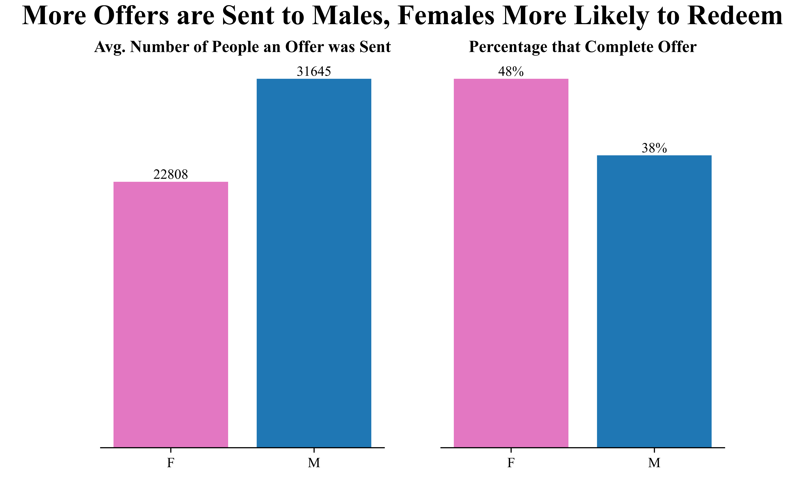

# Starbucks Promotional Offers Data Analysis
## Objectives
Starbucks is a global coffee shop chain, founded in 1971 in the United States. The company released a total of 300K+ rows of anonymised data on its events, customers members, and promotional offers across a 30 day period. This project investigates this data in order to uncover critical insights that will improve Starbucks' marketing success. Specifically, insights and recommendations are provided in the following areas:

- The performance of offers throghout the 30 day time period.
- The effectiveness of different distribution channels in exposing members to offers.
- How different customer demographics (e.g., age, income, gender, membership signup date) engage with offers.

An interactive Tableau Dashboard can be found [here](https://public.tableau.com/views/StarbucksPromotionalOffersDashboard/Dashboard?:language=en-US&:sid=&:redirect=auth&:display_count=n&:origin=viz_share_link).

The Python code utilised to clean the raw data can be found [here](https://github.com/rara-ch/starbucks_promotional_offers_analysis/blob/main/StarbucksPromotionalOffers_DataCleaning.ipynb).

## Data

The data source can be found [here](https://www.kaggle.com/datasets/ihormuliar/starbucks-customer-data).
## Executive Summary
Throughout the 30 day period, completions steadily increased, likely because offers were sent out more frequently in the second half of the 30 day period. The variety of offers sent out and the rate that these offers were viewed remained consitent throughout. The most impactful attribute that increased the likelyhood of an offer being viewed was if it was distributed through social media or not. This impactfullness was especially apparent for the company's young adult demographic. Buy One, Get One (BOGO) offers were more successful than discount offers in the short term. However, the completion rate of BOGO offers reduced significantly quicker than Discount offers in the following days. 

In terms of customer demographics, males and younger members engaged with offers at a lower rate than their respective demographic counterparts. The date that a customer became a member and their income level demonstrated no clear connection to how they engaged with offers.

Below is the Tableau dashboard, which can be found [here](https://public.tableau.com/views/StarbucksPromotionalOffersDashboard/Dashboard?:language=en-US&:sid=&:redirect=auth&:display_count=n&:origin=viz_share_link).

## Insights
### Performance Trends:
- **Each occassion offers were sent out, the total number of offers completed increased by an average of 1192 from the day before**. Offers were sent out on 6 occassions. Specifically, on days 0, 7, 14, 17, and 21. Each offer was sent out an average of 1271 times per occassion with little variance.
- **Although highly volitile, offers were completed at an increasing statistically significant (p = 0.04) rate of 26.5 more completions per day throughout the 30 day period**. Since other possible causes remained unchanged, this increase is most likely due to offers being sent out more frequently in the later half of the month than in the first half of the month. As stated above, days that offers were sent out increased the number of offers completed by an average of 1192 compared to the day before. Therefore, completions increased significantly on days offers were released before trailing off significantly in the coming days.

- **Discount offers were completed more than BOGO (buy one, get one) offers by 2180 throughout the 30 day period**. This is likely because although BOGO offers would do better than discount offers in the short term (on release days), the number of BOGO offers completed reduced at a faster rate than discount offers completed in following days.

### Distribution Effeciency:
- Offers that were **distributed through social media were viewed at a rate of 94.5%** compared to a **rate of 52.5% when not distributed through social media**.

- The impact of social media for distribution success is especially significant for the company's younger demographic **(20s & 30s), who view offers at a rate of 96.3% when the offer is distributed through social media versus 32.9% when it is not**.

### Customer Demographic Trends:
- On average, **Starbucks sends its offers to 38% more males compared to females**. This is despite the fact that **females engage with offers at a 10% higher rate than males**. Offers are viewed at a similar rate for both genders, indicating that females were more likely than males to redeem an offer after viewing it. 
  
  
- Younger people complete offers after viewing them at the lowest rate as the 20s, 30s, and 40s age groups have the three lowest completion rates from view at 48.3%, 48.4% and 54.3% respectively. The 20s, 30s, and 40s complete offers at the lowest rate after view independent of if the offer is distributed through the social media or not.

- The year a customer became a member and income both demonstrate no clear impact on customers' engagement with offers.

## Recommendations
- Prioritise distributing offers through social media to ensure offers are seen by the maximum number of members and to increase engagement of the younger demographic.
- Use targeted advertising campaigns to attract more female members.
- Release more BOGO and discount offers that go for the same duration so we can more accurately assess the success of each offer type.
